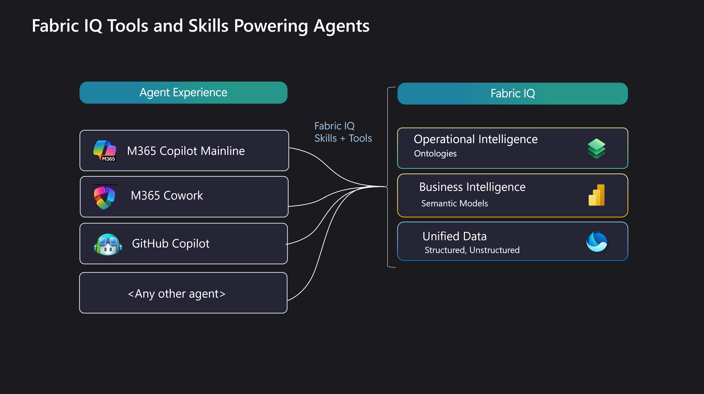

# Fabric IQ Eval

**Grounded, honest evaluation for Fabric IQ.** Author questions about your Power BI reports and
semantic models, pair each with a known-good answer, then have an agent answer them *blind* and
score the results — so you can prove your models answer business questions correctly *before*
your users find out the hard way.

<!-- Add your badges here once the repo is public, e.g.:


-->

> **Status:** Works today against Fabric IQ targets (Power BI reports, semantic models,
> dashboards). Written tool-agnostically — the same patterns extend to any tool or topic.

---

## Why this exists

[Fabric IQ](https://learn.microsoft.com/fabric/) makes your Fabric data and its semantics
available to agentic applications — the skills, tools, MCP servers, and APIs an agent needs to
reason over your data, not just your tables. It's now public in M365 Copilot and GA in Copilot
Cowork, which raises the obvious question:

> If business users are about to ask Copilot real questions about your reports, how do you know
> your **semantic models and reports are curated well enough to answer them correctly**?

A confident wrong answer is worse than no answer. This project lets you verify Fabric IQ the way
you'd regression-test anything you depend on: repeatedly, automatically, against known-good
answers.




Because the **Fabric IQ agentic interface is unified**, you don't have to test inside M365
Copilot itself — you can drive the *same* Fabric IQ skills and tools from **GitHub Copilot CLI**
and run your evaluations there. Each host has its own system prompt and extra context, so their
full answers differ, but Fabric IQ behaves identically for all of them. That's what makes a
GitHub-Copilot-driven evaluation meaningful.

---

## How it works

Two symmetric halves, each exposed as a **skill → agent** and driven from natural language:

```
 GENERATE                                   RUN
 ────────                                   ───
 "generate an eval suite for <X>"           INPUT FOLDER (*.eval.yaml)
        │                                          │  "run an evaluation on <folder>"
        ▼                                          ▼
 generate-eval skill                        run-eval skill
        ▼                                          ▼
 eval-generator AGENT                       eval-runner AGENT (orchestrator)
   ├─ resolve target (name/ws/URL)            ← coordinates; never answers questions itself
   ├─ inspect structure (visuals/schema)      ├─ discover & parse *.eval.yaml
   ├─ GROUND answers via live Fabric IQ        ├─ EXECUTE via isolated sub-agents:
   │     queries (real values/IDs/counts)     │     individual → fresh sub-agent per question
   └─ WRITE my-evaluation-suites/<slug>/      │     sequence   → one shared sub-agent, in order
         seq-*.eval.yaml (+ individual)       ├─ JUDGE each answer → score 0–100 + rationale
         + README                             └─ WRITE reports/eval-report-<timestamp>.{md,json}
        │                                  (append-only)
        └──────────────►  feeds  ──────────────►┘
```

### Two principles that make the scores trustworthy

**Grounded.** When the generator authors a suite it never invents values. It resolves the target
to real IDs, inspects its structure, and **queries the live object** to obtain every expected
answer — real totals, IDs, counts, and member names, never fabricated.

**Honest (context isolation).** The orchestrator that runs a suite has *read* the golden answers,
so it **never answers questions itself**. Answering is delegated to sub-agents that see only the
question text — never the expected answer, the assertions, or the other questions. `individual`
questions each get a fresh isolated sub-agent; a `sequence` runs all its turns in one shared
sub-agent (so turn *N* has the context of turns *1…N-1*) via a `=== ANSWER <id> ===` delimiter
protocol. Only safe "extra run context" (e.g. a workspace name) is ever forwarded.

> ⚠️ **Review generated suites before trusting them.** Grounding makes golden answers *plausible*,
> not *guaranteed correct* — the generator can pick the wrong measure or misread a filter. A wrong
> golden answer can still produce a passing run, because the same flawed reasoning may reproduce it
> at eval time. Treat a freshly generated suite as a **draft**: sanity-check every expected value
> against the report, and fix or drop anything you can't vouch for.

---

## Quick start

> Installation/clone instructions go here once the repo is public.

1. **Author a suite** — hand-write `*.eval.yaml` files in a folder (see
   [`examples/retailpulse-eval/`](examples/retailpulse-eval/)), or let Copilot bootstrap one for
   you. In GitHub Copilot CLI:

   ```text
   Generate an evaluation suite for the ZHN-Dashboard_update report
   ```

   Copilot inspects the object, asks for a complexity tier (**Quick** / **Solid** / **Custom**),
   grounds the expected answers by querying the live object, and writes a new suite under
   `my-evaluation-suites/<slug>/`.

2. **Run it:**

   ```text
   Run an evaluation on examples\retailpulse-eval
   ```

   You can append extra run context, e.g. *"…for Fabric workspace Contoso"* — it's forwarded to
   every answering sub-agent.

3. **Read the report** under `<your-folder>\reports\eval-report-<timestamp>.md` (a `.json`
   sidecar is written alongside). Prior reports are never overwritten.

---

## Eval file format at a glance

A `*.eval.yaml` file is a small, hand-editable YAML document. Two kinds, set by `type`:

| `type`       | Grouping             | Execution context                          | File convention        |
| ------------ | -------------------- | ------------------------------------------ | ---------------------- |
| `individual` | standalone questions | each runs in a **fresh, isolated** session | `individual.eval.yaml` |
| `sequence`   | one conversation     | all turns share **one** session, in order  | `seq-<name>.eval.yaml` |

```yaml
suite: My Questions
type: individual              # individual | sequence
defaults:
  pass_threshold: 70
questions:                    # use `turns:` when type is sequence
  - id: q1
    question: "What is total Revenue in the Retail Pulse report?"
    expected: "About $4.2M"
    assertions:               # natural-language checks the judge verifies (never shown to the answerer)
      - "States a dollar figure close to $4.2 million"
    pass_threshold: 80        # optional per-item override
    tags: [revenue]
```

Items carry `id`, `question`, `expected`, and optionally `assertions`, `pass_threshold`, and
`tags`. Pin any grounding ("answer only from this report") inside the `question` text — assertions
are scoring checks, never instructions to the answerer.

**Full specification:** [`docs/format-reference.md`](docs/format-reference.md).

---

## Example: a real run

[`examples/retailpulse-eval/`](examples/retailpulse-eval/) is a complete suite with a sample
report. A generated suite for a hospital-operations dashboard
([`my-evaluation-suites/zhn-dashboard-update/`](my-evaluation-suites/zhn-dashboard-update/)) opens
the report and drills from headline KPIs into a single unit across 8 turns — scoring **8/8, avg
97.5**, with a couple of points docked only for rounding `0.64 days` to `0.6`. The judge reads
intent, not strings: it credits a correct report ID even when the answer also returns a second
match, then explains the deduction in the rationale.

---

## Repository layout

| Path                                     | Purpose                                                         |
| ---------------------------------------- | --------------------------------------------------------------- |
| `docs/format-reference.md`               | Authoritative schema for eval files and reports.                |
| `.github/agents/eval-generator.agent.md` | Agent that authors a grounded eval suite for an object.         |
| `.github/agents/eval-runner.agent.md`    | Orchestrator agent that runs an evaluation.                     |
| `.github/skills/generate-eval/SKILL.md`  | Routes "generate an eval suite" → the generator.                |
| `.github/skills/run-eval/SKILL.md`       | Routes "run an evaluation" → the runner.                        |
| `prompts/`                               | Copy-paste prompts to author or run a suite.                    |
| `my-evaluation-suites/`                  | Generated suites land here (one folder per suite).              |
| `examples/retailpulse-eval/`             | Complete example suite + sample report.                         |

---

## Reports

Each run writes two timestamped files into `<input-folder>/reports/`:

- `eval-report-<YYYYMMDD-HHMMSS>.md` — human-readable: run header, per-suite summary table, and
  per-item detail (question, expected, actual, score, pass/fail, rationale, per-assertion checks).
- `eval-report-<YYYYMMDD-HHMMSS>.json` — machine-readable sidecar with the same data.

Timestamped filenames mean runs are **append-only** — earlier reports are never overwritten, so
you can track quality trends across changes.

---

## Roadmap

- ✅ **`generate-eval`** — authors grounded suites for a Power BI report or semantic model by
  inspecting the live object and querying it for real expected answers.
- 🔜 Extend generation to additional Fabric inputs — existing docs, transcripts, and more object
  types up to **ontologies** and **data agents**. The formats here are designed to support these
  with no framework changes.

---

## Contributing

Issues and pull requests welcome. The schema in `docs/format-reference.md` is the contract for
both file types — please keep generated and hand-written files conformant to it.

<!-- Add LICENSE and CONTRIBUTING references here. -->

